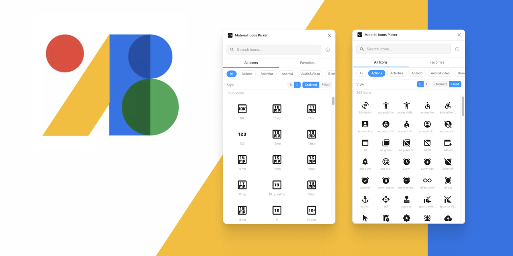

  

<h1 align="center">Material Icons Picker</h1>

Browse, search, and insert Google Material Symbols — always live, always current.

Figma Plugin

<a href="https://www.figma.com/community/plugin/1614730415386870995"><strong>Install from Figma Community</strong></a>

  

---

## What It Does

Gives you instant access to every Google Material Symbol, fetched live from Google's API on every launch — no manual updates, no stale libraries. Search, browse, copy icon names, or insert SVGs directly onto your canvas.

## Features

- **Smart search** — relevance-ranked results (exact match first, then prefix, contains, tag match). Typing "home" puts the `home` icon first, not `home_repair_service`.
- **Category filters** — Action, Android, Audio & Video, Communication, and more
- **Outlined / Filled** — toggle styles, setting saved across sessions
- **Small / Large** — icon size toggle, saved across sessions
- **Favorites** — star icons for quick access, persisted across sessions
- **Insert to canvas** — drop any icon as an SVG vector directly onto your Figma canvas
- **Copy icon name** — click any icon to copy its name for developer handoff
- **Enter to copy** — press Enter to copy the first search result
- **Escape to clear** — press Escape to clear the search field
- **Open on Google Fonts** — jump to any icon's detail page
- **Dark mode** — follows your Figma theme automatically
- **Performance** — lazy-loaded grid handles 3,000+ icons smoothly

## Install

### From Figma Community

<a href="https://www.figma.com/community/plugin/1614730415386870995"><strong>Install Material Icons Picker</strong></a>

### For development

1. Clone this repo
2. In Figma Desktop: **Plugins > Development > Import plugin from manifest...**
3. Select the `manifest.json` file from this folder

## Files

| File | Purpose |
|------|---------|
| `manifest.json` | Plugin manifest with network access declarations |
| `code.js` | Main plugin thread — SVG insert, persistence, notifications |
| `ui.html` | Full plugin UI — search, grid, favorites, styles |

## How It Works

The plugin fetches icon metadata from Google's Material Symbols API on launch, filters to icons supported by the Material Symbols Outlined font family, and renders them using the variable font loaded from Google Fonts CDN. User preferences (style, size, favorites) are stored via `figma.clientStorage` for cross-session persistence. SVG insertion uses `figma.createNodeFromSvg()` with vectors fetched from `fonts.gstatic.com`.

## Feedback

Found a bug or have a feature idea? [Open an issue](https://github.com/madebysan/material-icons-picker/issues).

## License

[MIT](LICENSE)

---

Made by [santiagoalonso.com](https://santiagoalonso.com)
